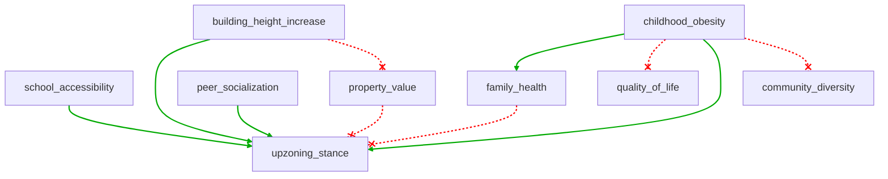

```mermaid
flowchart TD
%% Reconstructed Causal Graph
%% Nodes: 9
%% Edges: 10
    upzoning_stance[upzoning_stance]
    n2[building_height_increase]
    n3[school_accessibility]
    n4[family_health]
    n5[peer_socialization]
    n6[property_value]
    n7[childhood_obesity]
    n8[quality_of_life]
    n9[community_diversity]
    n2 --> upzoning_stance
    n2 --x n6
    n3 --> upzoning_stance
    n4 --x upzoning_stance
    n5 --> upzoning_stance
    n6 --x upzoning_stance
    n7 --> n4
    n7 --x n8
    n7 --> upzoning_stance
    n7 --x n9
    linkStyle 0 stroke:#00AA00,stroke-width:2px
    linkStyle 1 stroke:#FF0000,stroke-dasharray:3,stroke-width:2px
    linkStyle 2 stroke:#00AA00,stroke-width:2px
    linkStyle 3 stroke:#FF0000,stroke-dasharray:3,stroke-width:2px
    linkStyle 4 stroke:#00AA00,stroke-width:2px
    linkStyle 5 stroke:#FF0000,stroke-dasharray:3,stroke-width:2px
    linkStyle 6 stroke:#00AA00,stroke-width:2px
    linkStyle 7 stroke:#FF0000,stroke-dasharray:3,stroke-width:2px
    linkStyle 8 stroke:#00AA00,stroke-width:2px
    linkStyle 9 stroke:#FF0000,stroke-dasharray:3,stroke-width:2px
```