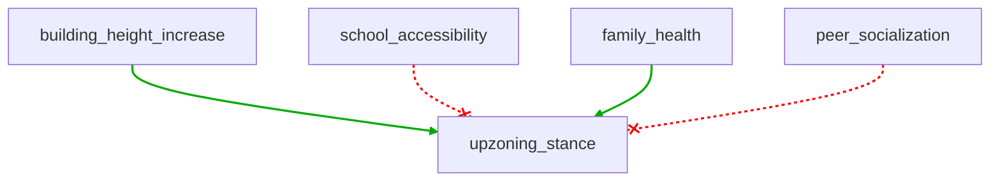

```mermaid
flowchart TD
%% Reconstructed Causal Graph
%% Nodes: 5
%% Edges: 4
    upzoning_stance[upzoning_stance]
    n2[building_height_increase]
    n3[school_accessibility]
    n4[family_health]
    n5[peer_socialization]
    n2 --> upzoning_stance
    n3 --x upzoning_stance
    n4 --> upzoning_stance
    n5 --x upzoning_stance
    linkStyle 0 stroke:#00AA00,stroke-width:2px
    linkStyle 1 stroke:#FF0000,stroke-dasharray:3,stroke-width:2px
    linkStyle 2 stroke:#00AA00,stroke-width:2px
    linkStyle 3 stroke:#FF0000,stroke-dasharray:3,stroke-width:2px
```