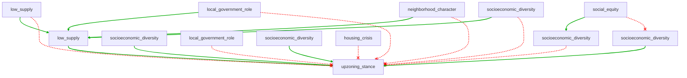

```mermaid
flowchart TD
%% Reconstructed Causal Graph
%% Nodes: 13
%% Edges: 17
    upzoning_stance[upzoning_stance]
    n2[low_supply]
    n3[socioeconomic_diversity]
    n5[socioeconomic_diversity]
    n6[local_government_role]
    n7[socioeconomic_diversity]
    n8[housing_crisis]
    n9[low_supply]
    n10[local_government_role]
    n11[neighborhood_character]
    n12[socioeconomic_diversity]
    n13[social_equity]
    n14[socioeconomic_diversity]
    n2 --> upzoning_stance
    n3 --x upzoning_stance
    n5 --> upzoning_stance
    n6 --x upzoning_stance
    n7 --> upzoning_stance
    n8 --x upzoning_stance
    n9 --> n2
    n9 --x upzoning_stance
    n10 --> n2
    n10 --x upzoning_stance
    n11 --> n2
    n11 --x upzoning_stance
    n12 --> n2
    n12 --x upzoning_stance
    n13 --> n3
    n13 --x n14
    n14 --> upzoning_stance
    linkStyle 0 stroke:#00AA00,stroke-width:2px
    linkStyle 1 stroke:#FF0000,stroke-dasharray:3,stroke-width:2px
    linkStyle 2 stroke:#00AA00,stroke-width:2px
    linkStyle 3 stroke:#FF0000,stroke-dasharray:3,stroke-width:2px
    linkStyle 4 stroke:#00AA00,stroke-width:2px
    linkStyle 5 stroke:#FF0000,stroke-dasharray:3,stroke-width:2px
    linkStyle 6 stroke:#00AA00,stroke-width:2px
    linkStyle 7 stroke:#FF0000,stroke-dasharray:3,stroke-width:2px
    linkStyle 8 stroke:#00AA00,stroke-width:2px
    linkStyle 9 stroke:#FF0000,stroke-dasharray:3,stroke-width:2px
    linkStyle 10 stroke:#00AA00,stroke-width:2px
    linkStyle 11 stroke:#FF0000,stroke-dasharray:3,stroke-width:2px
    linkStyle 12 stroke:#00AA00,stroke-width:2px
    linkStyle 13 stroke:#FF0000,stroke-dasharray:3,stroke-width:2px
    linkStyle 14 stroke:#00AA00,stroke-width:2px
    linkStyle 15 stroke:#FF0000,stroke-dasharray:3,stroke-width:2px
    linkStyle 16 stroke:#00AA00,stroke-width:2px
```