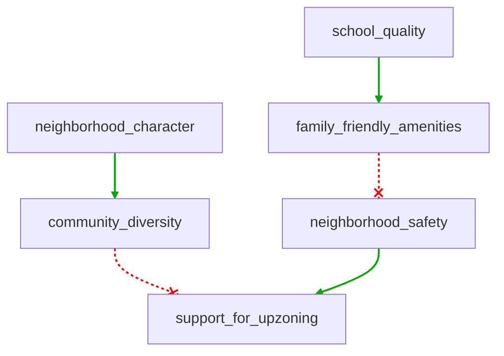

```mermaid
flowchart TD
%% Reconstructed Causal Graph
%% Nodes: 6
%% Edges: 5
    support_for_upzoning[support_for_upzoning]
    n2[neighborhood_character]
    n3[community_diversity]
    n4[school_quality]
    n5[family_friendly_amenities]
    n6[neighborhood_safety]
    n2 --> n3
    n3 --x support_for_upzoning
    n4 --> n5
    n5 --x n6
    n6 --> support_for_upzoning
    linkStyle 0 stroke:#00AA00,stroke-width:2px
    linkStyle 1 stroke:#FF0000,stroke-dasharray:3,stroke-width:2px
    linkStyle 2 stroke:#00AA00,stroke-width:2px
    linkStyle 3 stroke:#FF0000,stroke-dasharray:3,stroke-width:2px
    linkStyle 4 stroke:#00AA00,stroke-width:2px
```