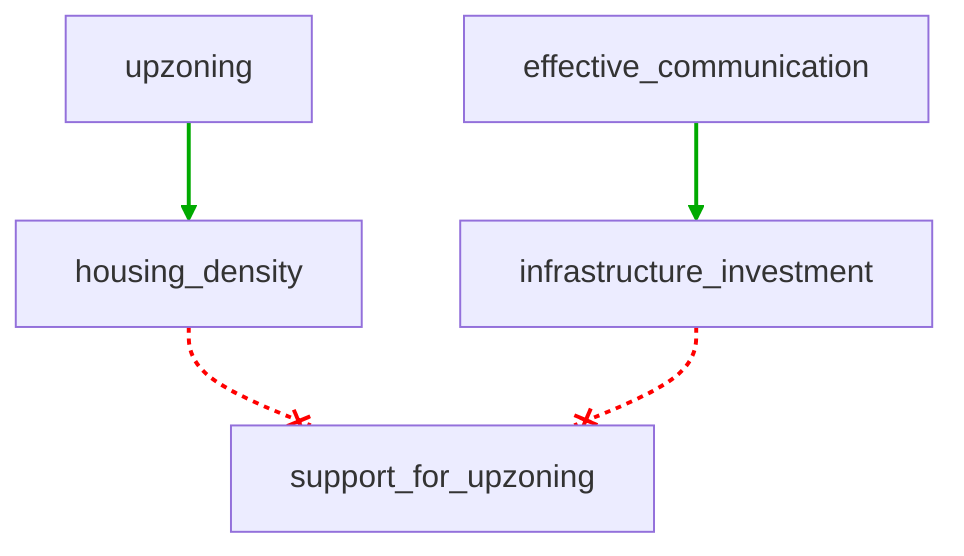

```mermaid
flowchart TD
%% Reconstructed Causal Graph
%% Nodes: 5
%% Edges: 4
    support_for_upzoning[support_for_upzoning]
    n2[upzoning]
    n3[housing_density]
    n4[effective_communication]
    n5[infrastructure_investment]
    n2 --> n3
    n3 --x support_for_upzoning
    n4 --> n5
    n5 --x support_for_upzoning
    linkStyle 0 stroke:#00AA00,stroke-width:2px
    linkStyle 1 stroke:#FF0000,stroke-dasharray:3,stroke-width:2px
    linkStyle 2 stroke:#00AA00,stroke-width:2px
    linkStyle 3 stroke:#FF0000,stroke-dasharray:3,stroke-width:2px
```